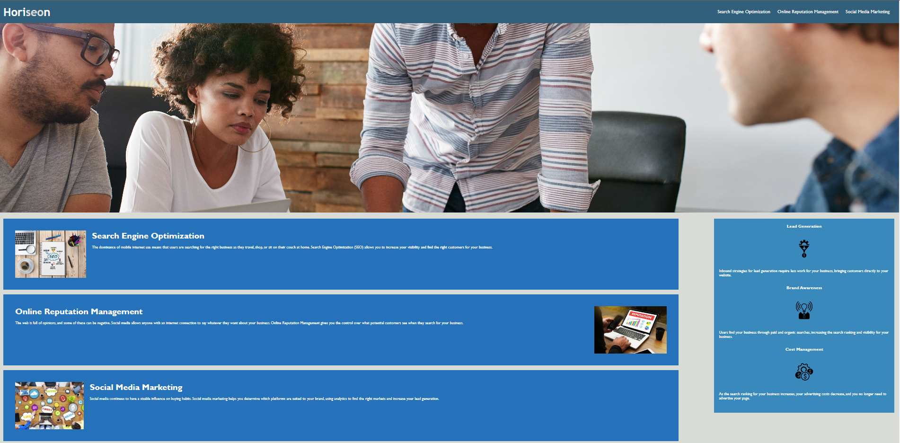

# Modue-1 Challenge

## Description

### User Story:

AS A marketing agency
I WANT a codebase that follows accessibility standards
SO THAT our own site is optimized for search engines

### Acceptance Criteria:

<ul>
<li>GIVEN a webpage meets accessibility standards</li>
<li>WHEN I view the source code</li>
<li>THEN I find semantic HTML elements</li>
<li>WHEN I view the structure of the HTML elements</li>
<li>THEN I find that the elements follow a logical structure independent of styling and positioning</li>
<li>WHEN I view the image elements</li>
<li>THEN I find accessible alt attributes</li>
<li>WHEN I view the heading attributes</li>
<li>THEN they fall in sequential order</li>
<li>WHEN I view the title element</li>
<li>THEN I find a concise, descriptive title</li>
</ul>

## Screenshot

</img>

## Links

<a href="https://github.com/tess147/Module-1">Repository URL</a>
<a href="https://tess147.github.io/Module-1/">Deployed Application URL</a>

## Authors

Tess Sevastos
https://github.com/tess147

## License

NA

## Acknowledgments

NA
